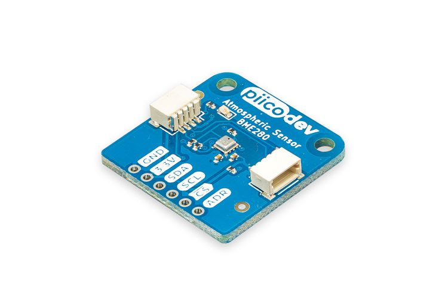

# PiicoDev® Atmospheric Sensor BME280

This is the repo for the Core Electronics [PiicoDev Atmospheric Sensor BME280](https://core-electronics.com.au/catalog/product/view/sku/CE07503).

The PiicoDev® Atmospheric Sensor allows you to easily measure barometric pressure, humidity, and temperature. Use it to build your own weather station or perform experiments. Better still, you can connect to this sensor using our PiicoDev system - no soldering is required to connect the PiicoDev Atmospheric Sensor to other devices in the PiicoDev family.

**Features**

- Measure temperature, pressure and relative humidity
- PiicoDev connector, compatible with Qwiic and STEMMA QT (3.3V only)
- 2.54mm breakout for breadboarding/prototyping
- Manufactured and [supported](https://core-electronics.com.au/contacts/) in Australia by Core Electronics

**Technical Specifications**

- The BME280 measures
  - -40 to +85°C
  - 0 to 100% Relative Humidity
  - 300 to 1100 hPa
- Breakout connector: 3.3V SPI interface, 5V tolerant I2C interface (with pull-up resistors to 3.3V)

# License
This project is open source - please review the LICENSE.md file for further licensing information.

If you have any technical questions, or concerns about licensing, please contact technical support on the [Core Electronics forums](https://forum.core-electronics.com.au/).

# Attribution
The hardware design of this module is influenced by the design from [Sparkfun](https://github.com/sparkfun/Qwiic_Atmospheric_Sensor_Breakout_BME280).

*\"PiicoDev\" and the PiicoDev logo are trademarks of Core Electronics Pty Ltd.*
